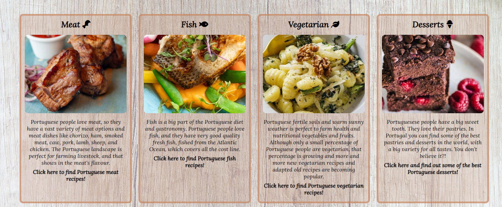

# Portuguese Flavors

## Click here to go to the webpage [Portuguese Flavors](https://claudio-cruz.github.io/portuguese-flavors/).
 
Portuguese Flavours is a website for people who are passionate about food and love to cook and eat. The website focuses on Portuguese gastronomy, which is one of the world's best gastronomies. Here you can find a variety of delicious recipes that are easy to make and separated into sections: meat, fish, vegetarian, and desserts. 
Our main goal is to give users access to the best and most famous Portuguese recipes in an easy and simple way to cook.

 

## Features

- __Navigation Bar__

  - The navigation bar gives users easy access to all pages of the website, including the home page, meat recipes, fish recipes, vegetarian recipes and dessert recipes.
  - It's easy to identify, having strong colour contrasts in relation to other elements, and it is at the top of all pages, enabling the user to navigate easily through the website.
  - The navigation menu is responsive, when the cursor is hover the option, the background colour changes to create a better experience for the users.

- __Main section__

  - The main section has four blocks that represent the recipe categories. Each one has the recipe section title, a respective picture and a short description of that particular section.
  - The blocks have the respective links added to them, enabling users to navigate easily through the website.

- __Sign up form__

  - The form is provided in an easy and simple way, requesting  only the first name, last name and email, giving users the  option to receive weekly recipes in their emails.

- __Footer__

  - The footer has social media logos with links connected to them. That gives the users easy access to the Portuguese Flavours social media platforms. Such as Instagram, Facebook, YouTube,and LinkedIn.

- __Meat recipes page__

    - The user can find meat recipes on the meat recipes page.
    - Each meat recipe includes a photo of the dish, an ingredient list, and a list of how to prepare it.
    - The meat recipes page follows the same structure and design as the home page, making the website intuitive.

- __Fish recipes page__

    - The user can find fish recipes on the fish recipes page.
    - Each fish recipe includes a photo of the dish, an ingredient list, and a list of how to prepare it.
    - The fish recipes page follows the same structure and design as the home page, making the website intuitive.

    

- __Vegetarian recipes page__

    - The user can find vegetarian recipes on the vegetarian recipes page.
    - Each vegetarian recipe includes a photo of the dish, an ingredient list, and a list of how to prepare it.
    - The vegetarian recipes page follows the same structure and design as the home page, making the website intuitive.

- __Dessert recipes page__

    - The user can find dessert recipes on the dessert recipes page.
    - Each dessert recipe includes a photo of the dish, an ingredient list, and a list of how to prepare it.
    - The dessert recipes page follows the same structure and design as the home page, making the website intuitive.

- __Features left to implement__

  - Inthe future it will implement a veagon and soup recipe sections, giving the user more recipes.
  - It will be also added to each recipe a preparation time of the recipe , difficulty of the recipe and how many serving per recipe.
  - There will be a review section for each recipe.

## Testing

 -  I tested that this page works in different browsers: Microsoft Edge, Chrome, Opera, Firefox and Safari.
  - I tested the website in a variety of screen sizes, including full screen, 1200px down, 800px down, 800px down, and 500px down.I confirmed that this project is responsive to all screen sizes.
  - I have confirmed that the form works in all different screen sizes and browsers, requiring the first name, the last name and a valid email. The submit button also works.

### Bugs

- __Solved bugs__
  - When I ran my HTML code in the W3C HTML Validator, I had a bug. It said that in my main section I should remove my closing p tags, but that would break the code. I solved the bug by reorganizing the section and giving more open and closing p tags to the section.
  -  When styling the recipes page, I had a bug when I was lining up two div elements. They had the same padding and the same margin, but the second div was puched down. I fixed this problem by restrocturing the section, putting both divs inside another div and giving the max-width 100% to both.

### Validator Testing

- __HTML__
  - No errors were returned, in all HTML pages, when passing through the official W3C HTML Validator;
     - Home page [W3C HTML Validator](https://validator.w3.org/nu/?doc=https%3A%2F%2Fclaudio-cruz.github.io%2Fportuguese-flavors%2Findex.html).
     - Meat recipes [W3C HTML Validator](https://validator.w3.org/nu/?doc=https%3A%2F%2Fclaudio-cruz.github.io%2Fportuguese-flavors%2Fmeat-recipes.html).
     - Fish recipes [W3C HTML Validator](https://validator.w3.org/nu/?doc=https%3A%2F%2Fclaudio-cruz.github.io%2Fportuguese-flavors%2Ffish-recipes.html).
     - Vegetarian recipes [W3C HTML Validator](https://validator.w3.org/nu/?doc=https%3A%2F%2Fclaudio-cruz.github.io%2Fportuguese-flavors%2Fvegetarian-recipes.html).
     - Dessert recipes [W3C HTML Validator](https://validator.w3.org/nu/?doc=https%3A%2F%2Fclaudio-cruz.github.io%2Fportuguese-flavors%2Fdesserts-recips.html).
- __CSS__
  - No errors were returned when passing through the official [(Jigsaw) Validator](https://jigsaw.w3.org/css-validator/validator?uri=https%3A%2F%2Fclaudio-cruz.github.io%2Fportuguese-flavors%2Findex.html&profile=css3svg&usermedium=all&warning=1&vextwarning=&lang=sv).

- __Accessibility__
  - By running it through the lighthouse in Devtolls, I confirmed that the website is easy to read with different colour contrasts, font contrasts and sizes.

  

- __Unfixed Bugs__
  - No unfixed bugs

### Deployment

- __The site was deployed to GitHub pages. The steps to deploy are as follows:__
  - In the GitHub repository, go to the Settings tab.
  - On the menu on the left side I selected Pages, to open GitHub Pages.
  - In the GitHub pages section, I selected Branch and changed to Main. That way, GitHub published the website in the repository, giving the link to the website.

The link can be found here - [Portuguese Flavors](https://claudio-cruz.github.io/portuguese-flavors/).