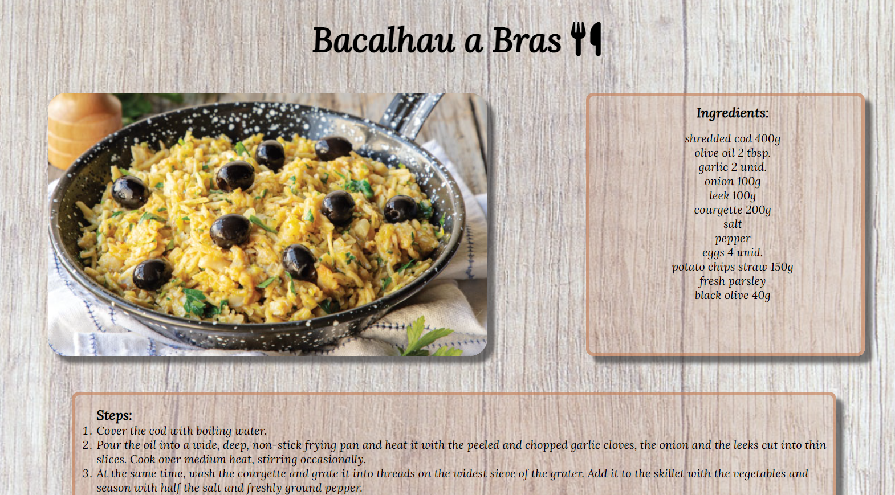

# Portuguese Flavors

Portuguese Flavours is a website for people who are passionate about food and love to cook and eat. The website focuses on Portuguese gastronomy, which is one of the world's best gastronomies. Here you can find a variety of delicious recipes that are easy to make and separated into sections: meat, fish, vegetarian, and desserts. 
Our main goal is to give users access to the best and most famous Portuguese recipes in an easy and simple way to cook.

## Features

- __Navigation Bar__

  - The navigation bar gives users easy access to all pages of the website, including the home page, meat recipes, fish recipes, vegetarian recipes and dessert recipes.
  - It's easy to identify, having strong colour contrasts in relation to other elements, and it is at the top of all pages, enabling the user to navigate easily through the website.
  - The navigation menu is responsive, when the cursor is hover the option, the background colour changes to create a better experience for the users.

- __Main section__

  - The main section has four blocks that represent the recipe categories. Each one has the recipe section title, a respective picture and a short description of that particular section.
  - The blocks have the respective links added to them, enabling users to navigate easily through the website.

- __Sign up form__

  - The form is provided in an easy and simple way, requesting  only the first name, last name and email, giving users the  option to receive weekly recipes in their emails.

- __Footer__

  - The footer has social media logos with links connected to them. That gives the users easy access to the Portuguese Flavours social media platforms. Such as Instagram, Facebook, YouTube,and LinkedIn.

- __Meat recipes page__

    - The user can find meat recipes on the meat recipes page.
    - Each meat recipe includes a photo of the dish, an ingredient list, and a list of how to prepare it.
    - The meat recipes page follows the same structure and design as the home page, making the website intuitive.

- __Fish recipes page__

    - The user can find fish recipes on the fish recipes page.
    - Each fish recipe includes a photo of the dish, an ingredient list, and a list of how to prepare it.
    - The fish recipes page follows the same structure and design as the home page, making the website intuitive.

    

- __Vegetarian recipes page__

    - The user can find vegetarian recipes on the vegetarian recipes page.
    - Each vegetarian recipe includes a photo of the dish, an ingredient list, and a list of how to prepare it.
    - The vegetarian recipes page follows the same structure and design as the home page, making the website intuitive.

- __Dessert recipes page__

    - The user can find dessert recipes on the dessert recipes page.
    - Each dessert recipe includes a photo of the dish, an ingredient list, and a list of how to prepare it.
    - The dessert recipes page follows the same structure and design as the home page, making the website intuitive.

    